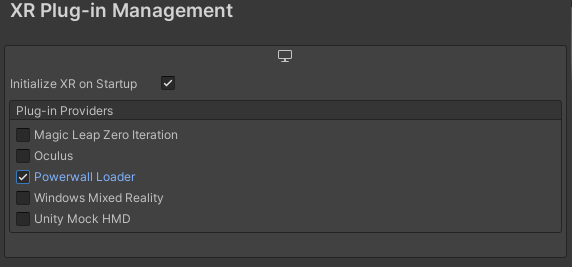
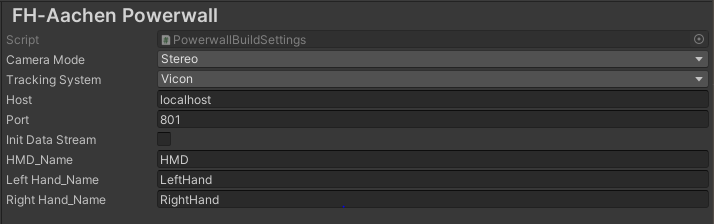
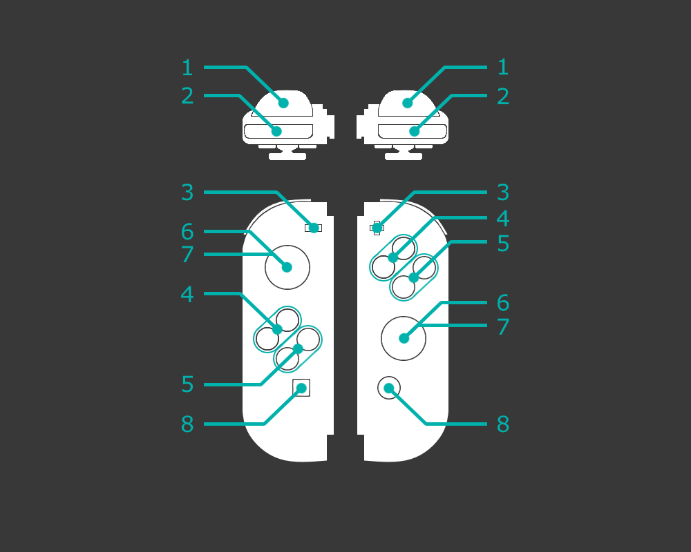

# PowerWallUnityPackage

## 1) Requirements

- Unity Version 2020.3 LTS or higher (tested on 2020.3.1f1)
- Unity XR Plugin Management System Version 4.0.0 or higher (tested on 4.01)
- Unity XR Interaction Toolkit Version 1.0.0 or higher (tested on 1.0.0-pre3)

## 2) Installation

### 2.1) Importing the Powerwall Package

Open a terminal (e.g. Git Bash) in the project directory.

#### 2.1.1) Importing into existing Git Project

```
    cd Packages
    git submodule add git@git.fh-aachen.de:maskor/powerwall/fhaachen.powerwall.git
```

#### 2.1.2) Importing into local Project

```
    cd Packages
    git clone git@git.fh-aachen.de:maskor/powerwall/fhaachen.powerwall.git
```

### 2.2) Enabling the Plugin

- Open your Unity Project
- Open `Edit -> Project Settings -> XR Plug-in Management`
- Select `Powerwall Loader`  


### 2.3) Package Settings

Open `Edit -> Project Settings -> XR Plug-in Management -> FH-Aachen Powerwall`  
  

- `Camera Mode`: Decides if the main camera will be replaced with a stereoscopic camera
  - `Stereo`: Main camera will be replaced with a stereoscopic camera
  - `Mono`: Main camera will be left as is
- `Tracking System`: Decides which tracking system will be used
  - `None`: Disable tracking
  - `Vicon`: Use the Vicon tracking system
  - `Dtrack2`: Use the DTrack2 tracking system
- `Host`: IP-Adress on which the tracking data will be expected
- `Port`: Port on which the tracking data will be expected
- `Init Data Stream`: If checked, will instantiate a `DataStream`-Object in the scene.  
(Needed for `DTrack2`-tracking, and  for `Vicon`-tracking of objects other than Head and Hands).
- `HMD_Name`: Name of the Object in the `Vicon` tracking software, that represents the head.
- `Left Hand_Name`: Name of the Object in the `Vicon` tracking software, that represents the left hand.
- `Right Hand_Name`: Name of the Object in the `Vicon` tracking software, that represents the right hand.

## 3) Usage

### 3.1) XR-Demo
The plugin comes with an pre assembled asset bundle which contains everything needed to run a simple scene with a fully setup rig and a playspace to explore some of the features provided by Unity XR and the Unity XR Interaction Toolkit. <br>
This asset bundle is located in the folder of the plugin: `Your Project/Packages/fhaachen.powerwall/XR-Demo.asset` or in the Unity Editor in the `Packages` section: `fhaachen.powerwall/XR-Demo.asset`. Double clicking the file will open an import window. Keep everything selected and click on import. <br>
After importing the asset bundle there should be a new folder called `XR-Demo` in your `Asset` folder. This folder contains all the necessary Ressources and Scripts. It also contains a scene called `Playground` in the `Scenes` folder. <br>
The XR Rig is the most important object in the scene since it handles tracking, input, movement and interaction of the user and the soroundings in the scene. It has a control script aplied to it which is called `PlayerController` which provides multiple settings which are explained in detail in section 3.1.5.

### 3.1.2) Demo Components

The demo contains multiple important components, which can be used in further development. To understand the most important components they are explained in the following sections

#### 3.1.3) Action Map

The provided action map contains actions for joycons and other VR Systems.<br>
These actions can be expanded, edited or deleted by changing the action map.<br>
It is located at `fhaachen.powerwall/Resources/Default Input Actions/XRI Default Input Actions.inputactions` and can be edited by simply double-clicking it in the Unity Editor Project window.<br>
For further information on action maps and actions, please use the deocumentation on [Actions](https://docs.unity3d.com/Packages/com.unity.inputsystem@0.2/manual/Actions.html) provided by Unity.

#### 3.1.4) Controller Keybinds

The buttons on the joycons are mapped (via the provided action map) as follows:<br>

| ID | Hand | Action | Description |
| ------ | ------ | ------ | ------ |
| 1 | both | press | Grab objects |
| 2 | both | press | Select UI element |
| 3 | both | press | Not used |
| 4 | left | press | Toggle pointer |
| 4 | right | press | Not used |
| 5 | both | press | Not used |
| 6 | both | press | Not used |
| 7 | left | move up | Select teleportation endpoint |
| 7 | left | move | Move rig |
| 7 | right | move left/right | Rotate rig |
| 8 | both | press | Not used |

#### 3.1.5) Player Controller

On the XR Rig Prefab is a script called `Player Controller`. This script handles the initialisation of the rig, movement, turning and other components. <br>
Altering the parameters of this component changes the behaviour of the rig as follows:
- `Locomotion Type`: Changes the way the rig moves
  - `CONTINUOUS`: The rig moves fluently 
  - `TELEPORT`: Teleports the rig to the selected location
- `Turn Type`: Changes the way the rig rotates (turns)
  - `CONTINUOUS`: The rig rotates fluently
  - `SNAP`: The rig rotates in steps (fixed amount)
- `Pointer Hand`: Changes the hand which has a pointer
  - `LEFT`: Pointer on the left hand
  - `RIGHT`: Pointer on the right hand
- `Teleportation Hand`: Changes the hand which selects the teleportation endpoint
  - `LEFT`: Selecting with the left hand
  - `RIGHT`: Selecting with the right hand

### 3.2) Custom Implementation

It is not necessary to use the provided demo files, since the needed XR-Rig can be created manually and configured from scratch.
However there are two things to keep in mind:
- If your camera is present in the scene from the beginning:
  - ensure that the camera is tagged as `Main Camera` and under a GameObject which handles position and rotation tracking.
  - Select `Stereo` as `Camera Mode` in the Plugin Settings
- If your camera is instantiated at a later point of time:
  - replace your camera with the prefab located in the plugin folder:  
  `fhaachen.powerwall/Resources/StereoCamera.prefab`

### 3.2) Keymapping

The joycons are mapped to specific inputs named after the Unity XR input scheme. Creating a new Action Map or reading specific inputs requires the actions and its name. Those actions/names are mapped to the joycons as follows (actions on both hands are named identically and split into left and right hand actions):<br>

| ID | Name | Action | Type | Control Type |
| ------ | ------ | ----- | ----- | ----- |
| * | devicePosition |  | Value | Vector3 |
| * | deviceRotation |  | Value | Vector3 |
| 1 | gripPressed | press | Button |  |
| 1 | grip | press | Value | Axis |
| 2 | triggerPressed | press | Button |  |
| 2 | trigger | press | Value | Axis |
| 3 | menu | press | Button |  |
| 4 | primaryButton | press | Button |  |
| 5 | secondaryButton | press | Button |  |
| 6 | primary2DAxisClick | press | Button |  |
| 7 | primary2DAxis | move | Value | Vector2 |
| 8** |  | press | Button |  |

_* These entries reflect the state of the joycon itself_
<br>_** Not mapped_

### 3.3) Further information

For more information on Unity XR, Unity XR Plugin Management, Unity XR Interaction Toolkit or the Unity Input System please use the corresponding documentation provided by Unity:

- [Unity XR](https://docs.unity3d.com/Manual/XR.html)
- [Unity XR Plugin Management](https://docs.unity3d.com/Packages/com.unity.xr.management@4.0/manual/index.html)
- [Unity XR Interaction Toolkit](https://docs.unity3d.com/Packages/com.unity.xr.interaction.toolkit@1.0/manual/index.html)
- [Unity Input System](https://docs.unity3d.com/Packages/com.unity.inputsystem@1.0/manual/QuickStartGuide.html)

### 3.3) Tracking Objects

#### 3.3.1) Vicon

Tracking with the Vicon System (HMD, Left Hand, Right Hand) is fully supported by the plugin and Unity XR and can be used as described above in section 3.

#### 3.3.2) General tracking

- Either select the `init DataStream` option in the plugin settings or add the `DataStream` prefab, located at `Your Project/Packages/fh-aachen.powerwall.xrplugin/Resources/GeneralTracking/TrackingDataStream.prefab` to your scene.
- Add the `TrackingBody` prefab to the scene and set the `Body Name`(`Vicon`) and the `BodyID`(`DTrack2`) according to your tracking software.
- Or add the `TrackingBody` component to your GameObject and set the `Body Name`(`Vicon`) and the `BodyID`(`DTrack2`) according to your tracking software.
- Or use the editor function located at `GameObject/XR/Make GameObject trackable` and set the `Body Name`(`Vicon`) and the `BodyID`(`DTrack2`) according to your tracking software.
